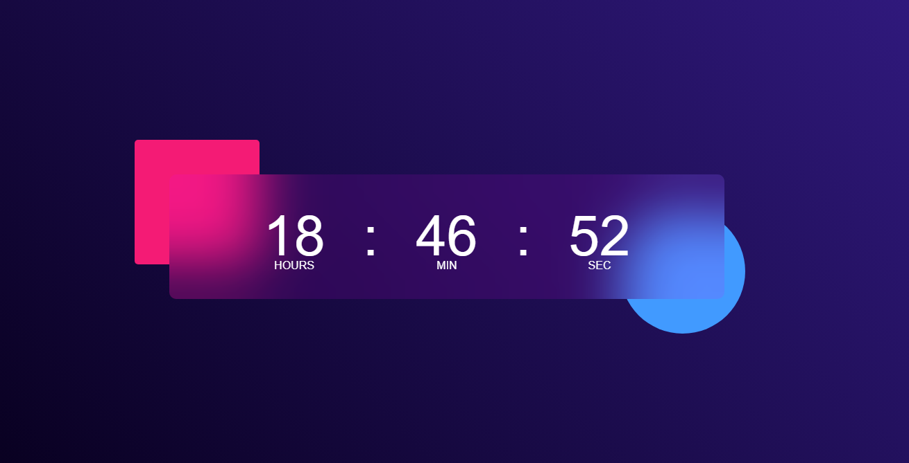

# Digital Clock Using JavaScript

## Screenshot




A simple and stylish digital clock web app built with HTML, CSS, and JavaScript.

## Features

- Displays the current hours, minutes, and seconds in real time
- Responsive and modern glassmorphism design
- Easy to customize

## Getting Started

### Prerequisites

- Any modern web browser

### Usage

1. **Clone or Download the Repository**
   ```bash
   git clone https://github.com/yourusername/digital-clock.git
   cd digital-clock
   ```

2. **Open `index.html` in your browser**
   - Double-click the `index.html` file  
   **OR**
   - Run a local server (optional):
     ```bash
     python3 -m http.server
     ```
     Then visit [http://localhost:8000](http://localhost:8000) in your browser.

## File Structure

```
digital-clock/
├── index.html      # Main HTML file
├── style.css       # Styling for the clock
└── script.js       # JavaScript for updating the time
```

## Customization

- **Colors & Fonts:** Edit `style.css` to change the appearance.
- **Time Format:** Modify `script.js` if you want 12-hour format or  AM/PM.


## License

This project is open source and available under the [MIT License](LICENSE).

🚀 Built a stylish Digital Clock with HTML, CSS & JavaScript!
⏰ Real-time updates, glassmorphism design, and easy to customize.
Check it out & make your own!
#JavaScript #WebDevelopment #100DaysOfCode